# 🌾 Wheat Vegetation Index Pipeline
### Complete Technical Architecture & Developer Manual

> **Camera:** MAPIR Survey3W OCN · **Language:** Python 3.10+ · **Paradigm:** Classical Computer Vision · **Output:** NDVI = +0.1048

---

## 🗂 Table of Contents

| # | Section | Description |
|---|---------|-------------|
| 1 | [Project Overview](#1--project-overview) | What, why, who, and expected results |
| 2 | [System Architecture](#2--system-architecture) | Complete architecture diagram |
| 3 | [Pipeline Flowchart](#3--pipeline-flowchart) | End-to-end visual pipeline |
| 4 | [Data State Diagram](#4--data-state-diagram) | How data transforms at each stage |
| 5 | [Folder Structure](#5--folder-structure) | Directory layout and relationships |
| 6 | [Module Dependency Graph](#6--module-dependency-graph) | How files communicate |
| 7 | [Execution Flow & Call Graph](#7--execution-flow--call-graph) | What happens when you run the pipeline |
| 8 | [Phase-by-Phase Deep Dive](#8--phase-by-phase-deep-dive) | Every phase explained in full |
| 9 | [Vegetation Index Selection](#9--vegetation-index-selection) | Decision tree + comparison table |
| 10 | [Segmentation Strategy](#10--segmentation-strategy) | Multi-cue CV vs Deep Learning |
| 11 | [Library Reference](#11--library-reference) | Every dependency explained |
| 12 | [Configuration Reference](#12--configuration-reference) | Every config parameter |
| 13 | [Error Handling Map](#13--error-handling-map) | What fails, what recovers, what doesn't |
| 14 | [Outputs Reference](#14--outputs-reference) | Every generated file |
| 15 | [Extension Guide](#15--extension-guide) | How to add VIs, cameras, DL models |
| 16 | [FAQ](#16--frequently-asked-questions) | 50 practical questions answered |
| 17 | [Glossary](#17--glossary) | Key terms |
| 18 | [Known Bugs & Improvements](#18--known-bugs--improvements) | Honest engineering assessment |
| 19 | [References](#19--references) | Papers, docs, books |

---

## 1 · Project Overview

### 🔬 What problem does this solve?

Wheat crops respond to stress by reducing chlorophyll. This changes how they interact with light:

```
Healthy leaf:   absorbs RED (~650 nm) ↓↓↓   reflects NIR (~850 nm) ↑↑↑  → NDVI high
Stressed leaf:  absorbs RED (~650 nm) ↓      reflects NIR (~850 nm) ↑    → NDVI low
Bare soil:      reflects RED and NIR equally                              → NDVI ≈ 0
```

A human cannot measure this by eye. This pipeline automates measurement from a MAPIR Survey3W OCN multispectral camera image.

---

### 🎯 Target Users

| User | Use Case |
|------|----------|
| Plant scientist | Measure wheat stress across field plots |
| Agronomist | Compare canopy health over time |
| CV engineer | Classical baseline before deep learning |
| Graduate student | Learn proximal sensing & image analysis |

---

### 📦 Expected Outputs

After running on one image:

| Output | Format | Description |
|--------|--------|-------------|
| `leaf_mask.png` | PNG 8-bit | Binary: white = leaf, black = background |
| `leaf_only.png` | PNG 8-bit RGB | Leaf pixels only, background zeroed |
| `NDVI_map.tif` | Float32 GeoTIFF | Per-pixel NDVI, NaN outside leaf |
| `visualization.png` | PNG 2700×1650 | 6-panel diagnostic figure |
| `results.csv` | CSV | Appended row with mean VI and stats |
| `pipeline.log` | Text | Full decision audit trail |

---

### ⚡ Performance Snapshot (Real Run)

```
Image:       5feb_1_MSI_A930.jpg
Resolution:  4000 × 3000 px  (12 megapixels)
Camera:      MAPIR Survey3W OCN
Total time:  46.6 seconds on CPU
Leaf pixels: 1,111,364  /  12,000,000  (9.26%)
Average NDVI (leaf only):  +0.1048
```

---

## 2 · System Architecture

```
┌─────────────────────────────────────────────────────────────────────────────┐
│                         WHEAT VI PIPELINE SYSTEM                            │
│                                                                             │
│  ┌──────────┐   ┌──────────────────────────────────────────────────────┐   │
│  │   USER   │   │                  main.py (Orchestrator)              │   │
│  │          │──▶│  • CLI (argparse)   • Config loader   • Logging      │   │
│  │--input   │   │  • process_one()    • run_batch()     • Timing       │   │
│  │--batch   │   └──────────────────────────┬───────────────────────────┘   │
│  │--config  │                              │                               │
│  └──────────┘              ┌───────────────┼───────────────────────────┐   │
│                            │               │                           │   │
│              ┌─────────────▼──┐  ┌─────────▼──────┐  ┌───────────────▼┐  │
│              │  phase1_inspect │  │phase2_preprocess│  │phase3_segment  │  │
│              │                │  │                 │  │                │  │
│              │ • Read file     │  │ • Resize        │  │ • NDVI cue     │  │
│              │ • Parse EXIF   │  │ • NLM denoise   │  │ • HSV cue      │  │
│              │ • Camera detect│  │ • CLAHE         │  │ • Shadow cue   │  │
│              │ • Band mapping  │  │ • Radio check   │  │ • Morph clean  │  │
│              └──────┬─────────┘  └────────┬────────┘  └───────┬────────┘  │
│                     │                     │                    │           │
│              arr+meta+band_cfg         arr_pre              mask+ndvi      │
│                     │                     │                    │           │
│              ┌──────▼─────────────────────▼────────────────────▼──────┐   │
│              │              phase45_vi.py                              │   │
│              │   Phase 4: remove_background()  Phase 5: compute_vi()  │   │
│              └──────────────────────────┬──────────────────────────────┘   │
│                                         │  vi_map + avg_vi + vi_name       │
│              ┌──────────────────────────▼──────────────────────────────┐   │
│              │              phase67_output.py                          │   │
│              │   Phase 6: visualize()          Phase 7: save_outputs() │   │
│              └──────────────────────────┬──────────────────────────────┘   │
│                                         │                                  │
│                          ┌──────────────▼──────────────┐                  │
│                          │        OUTPUT DIRECTORY      │                  │
│                          │  masks/ · vi_maps/ · csv/    │                  │
│                          │  visualizations/ · logs/     │                  │
│                          └─────────────────────────────┘                  │
│                                                                             │
│  ── Config ──────────────────────────────────────────────────────────────  │
│  config/config.yaml  →  All tuneable parameters injected via cfg dict      │
└─────────────────────────────────────────────────────────────────────────────┘
```

---

## 3 · Pipeline Flowchart

### Mermaid Diagram

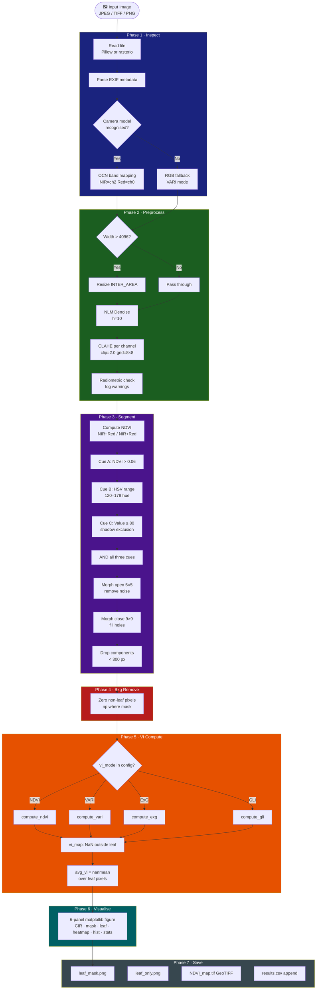

---

### Text Pipeline (Quick Reference)

```
  ┌──────────────────────────────────────────────────────────────────┐
  │ STAGE            │ INPUT              │ OUTPUT                    │
  ├──────────────────┼────────────────────┼───────────────────────────┤
  │ 1 · Inspect      │ File path (string) │ arr (H,W,3) float32       │
  │                  │                    │ metadata dict             │
  │                  │                    │ band_cfg dict             │
  ├──────────────────┼────────────────────┼───────────────────────────┤
  │ 2 · Preprocess   │ arr, band_cfg, cfg │ arr_pre (H,W,3) float32   │
  ├──────────────────┼────────────────────┼───────────────────────────┤
  │ 3 · Segment      │ arr_pre, band_cfg  │ mask (H,W) bool           │
  │                  │ cfg                │ ndvi_raw (H,W) float32    │
  ├──────────────────┼────────────────────┼───────────────────────────┤
  │ 4 · Bkg Remove   │ arr_pre, mask      │ leaf_image (H,W,3) float32│
  ├──────────────────┼────────────────────┼───────────────────────────┤
  │ 5 · Compute VI   │ leaf_image, mask   │ vi_map (H,W) float32+NaN  │
  │                  │ band_cfg, cfg      │ avg_vi  scalar float      │
  │                  │                    │ vi_name string            │
  ├──────────────────┼────────────────────┼───────────────────────────┤
  │ 6 · Visualise    │ all of the above   │ visualization.png         │
  ├──────────────────┼────────────────────┼───────────────────────────┤
  │ 7 · Save         │ all of the above   │ 4 files + CSV row         │
  └──────────────────┴────────────────────┴───────────────────────────┘
```

---

## 4 · Data State Diagram

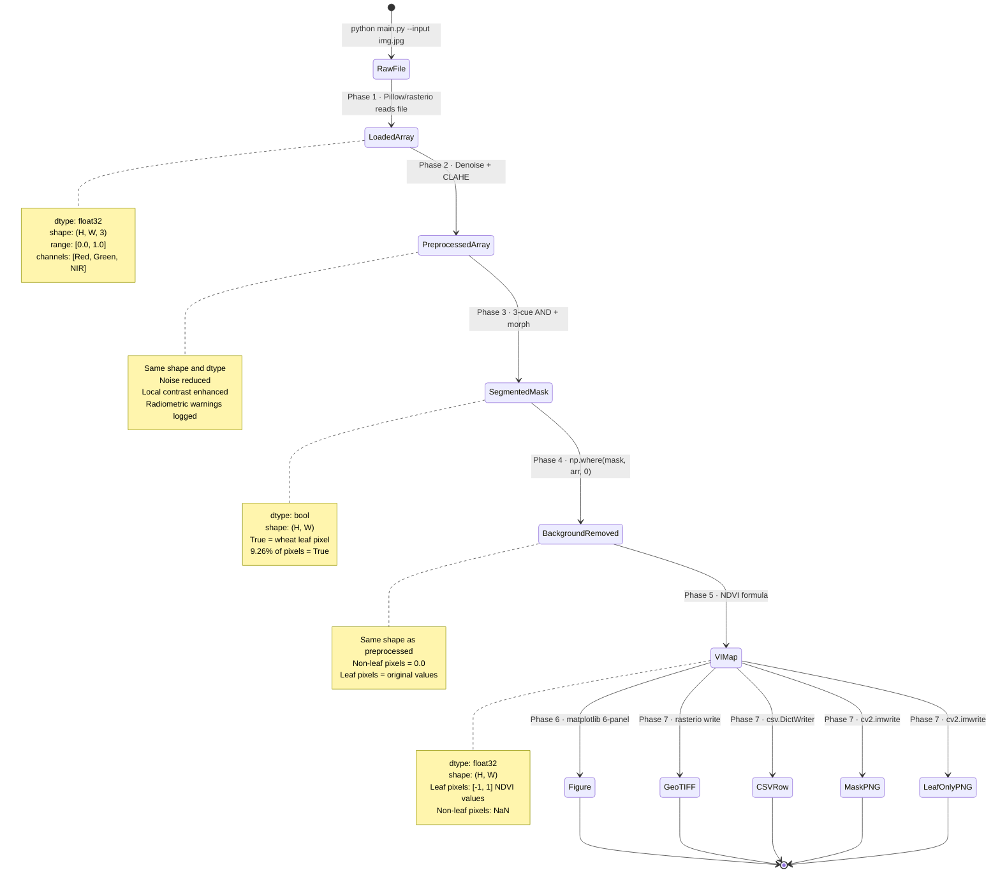

---

### Data Transformation at Each Stage — Input vs Output

```
Stage 1: FILE → ARRAY
─────────────────────
Before: "input/5feb_1_MSI_A930.jpg"          (1.8 MB on disk, JPEG compressed)
After:  np.ndarray shape (4000, 3000, 3)     (144 MB in RAM, float32 [0,1])

Stage 2: RAW → CLEANED
───────────────────────
Before: Noisy pixels, uneven local contrast
After:  Smoother pixel values, local contrast improved per-channel

Stage 3: IMAGE → MASK
──────────────────────
Before: (4000, 3000, 3) float32
After:  (4000, 3000)    bool     ← 11.7 MB instead of 144 MB

Stage 4: FULL IMAGE → LEAF IMAGE
──────────────────────────────────
Before: 12,000,000 pixels with values
After:  1,111,364 pixels with values + 10,888,636 pixels = 0.0

Stage 5: PIXELS → MEASUREMENT
───────────────────────────────
Before: Three channels [Red, Green, NIR] per leaf pixel
After:  One float per leaf pixel (NDVI)
        Scalar: avg_vi = 0.1048

Stage 6 & 7: ARRAYS → FILES
─────────────────────────────
Before: Five NumPy arrays in RAM
After:  Six files on disk
```

---

## 5 · Folder Structure

### Directory Tree

```
wheat_vi_pipeline/
│
├── 📄 main.py                         ← Entry point. Orchestrates all phases.
├── 📄 requirements.txt                ← Python dependencies.
│
├── 📁 config/
│   └── 📄 config.yaml                 ← ALL tuneable parameters. No code changes needed.
│
├── 📁 src/                            ← Core processing logic. One file per phase.
│   ├── 📄 phase1_inspect.py           ← Phase 1: Image loading + camera detection
│   ├── 📄 phase2_preprocess.py        ← Phase 2: Noise removal + contrast
│   ├── 📄 phase3_segment.py           ← Phase 3: Leaf segmentation (3-cue CV)
│   ├── 📄 phase45_vi.py               ← Phase 4+5: Background removal + VI math
│   ├── 📄 phase67_output.py           ← Phase 6+7: Visualisation + file saving
│   └── 📁 __pycache__/               ← Python bytecode cache. Ignore / don't commit.
│
├── 📁 input/
│   └── 🖼 5feb_1_MSI_A930.jpg         ← Demo image (MAPIR OCN, 4000×3000, 1.8 MB)
│
├── 📁 output/
│   ├── 📁 masks/
│   │   ├── 🖼 *_leaf_mask.png          ← Binary segmentation mask
│   │   └── 🖼 *_leaf_only.png          ← Leaf pixels, background zeroed
│   ├── 📁 vi_maps/
│   │   └── 🗺 *_NDVI_map.tif           ← Float32 GeoTIFF VI map
│   ├── 📁 csv/
│   │   └── 📊 results.csv              ← Cumulative results table
│   └── 📁 visualizations/
│       └── 🖼 *_visualization.png       ← 6-panel diagnostic figure
│
└── 📁 logs/
    └── 📄 pipeline.log                ← Full execution log (append mode)
```

---

### Folder Dependency Diagram

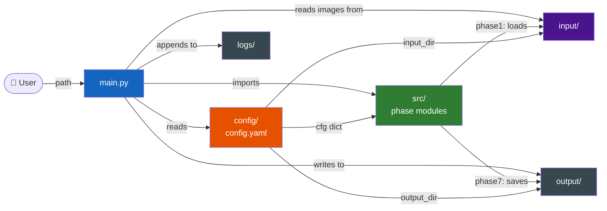

---

## 6 · Module Dependency Graph

### Import Relationships

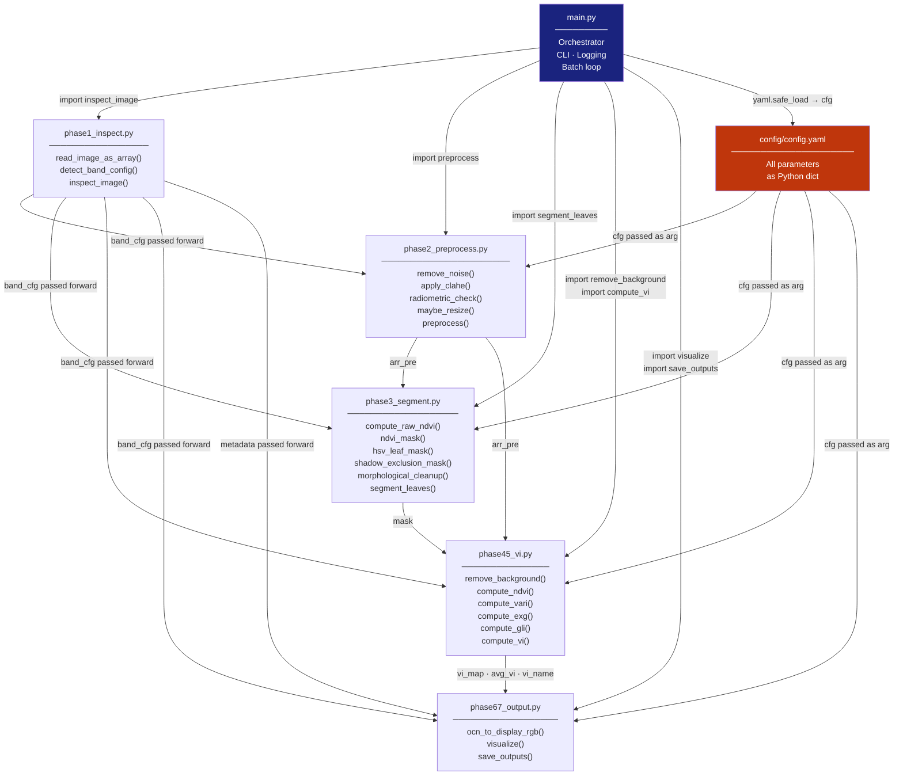

---

### Data Contracts Between Modules

```
┌──────────────────────────────────────────────────────────────────────┐
│  MODULE          SENDS ───────────────────────────▶ MODULE            │
├──────────────────────────────────────────────────────────────────────┤
│  phase1          arr_orig  (H,W,3) float32 [0,1]  → main.py          │
│  phase1          metadata  dict                    → main.py, phase67 │
│  phase1          band_cfg  dict                    → all phases       │
├──────────────────────────────────────────────────────────────────────┤
│  phase2          arr_pre   (H,W,3) float32 [0,1]  → main.py          │
├──────────────────────────────────────────────────────────────────────┤
│  phase3          mask      (H,W) bool              → main.py          │
│  phase3          ndvi_raw  (H,W) float32           → main.py (unused) │
├──────────────────────────────────────────────────────────────────────┤
│  phase45         leaf_image (H,W,3) float32        → main.py          │
│  phase45         vi_map    (H,W) float32 + NaN     → main.py          │
│  phase45         avg_vi    scalar float            → main.py          │
│  phase45         vi_name   string e.g. "NDVI"      → main.py          │
├──────────────────────────────────────────────────────────────────────┤
│  phase67         visualization.png                 → disk             │
│  phase67         leaf_mask.png                     → disk             │
│  phase67         leaf_only.png                     → disk             │
│  phase67         NDVI_map.tif                      → disk             │
│  phase67         results.csv (append)              → disk             │
└──────────────────────────────────────────────────────────────────────┘
```

---

## 7 · Execution Flow & Call Graph

### Sequence Diagram

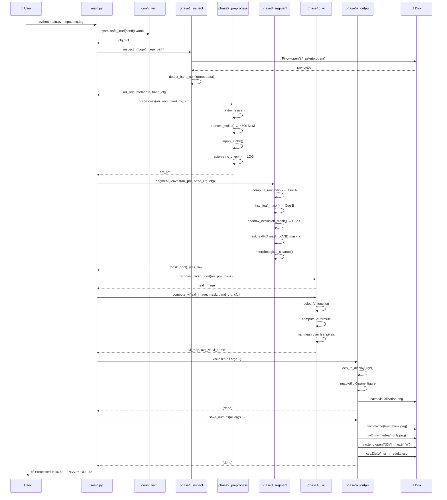

---

### Function Call Hierarchy

```
python main.py --input input/img.jpg
│
└── main()
    ├── load_config("config/config.yaml")
    │   └── yaml.safe_load(f)
    │
    └── process_one(image_path, cfg)
        │
        ├── [Phase 1] inspect_image(image_path)
        │   ├── read_image_as_array(image_path)
        │   │   ├── rasterio.open()     [if .tif]
        │   │   └── PIL.Image.open()    [JPEG/PNG]
        │   │       └── pil_img._getexif()
        │   └── detect_band_config(metadata)
        │
        ├── [Phase 2] preprocess(arr_orig, band_cfg, cfg)
        │   ├── maybe_resize(arr, max_width=4096)
        │   │   └── cv2.resize()
        │   ├── remove_noise(arr, h=10)
        │   │   └── cv2.fastNlMeansDenoisingColored()  ← slowest step
        │   ├── apply_clahe(arr, clip=2.0, grid=(8,8))
        │   │   └── cv2.createCLAHE().apply()  [per channel]
        │   └── radiometric_check(arr, band_cfg)
        │
        ├── [Phase 3] segment_leaves(arr_pre, band_cfg, cfg)
        │   ├── compute_raw_ndvi(arr, band_cfg)        [Cue A]
        │   ├── ndvi_mask(ndvi, threshold=0.06)
        │   ├── hsv_leaf_mask(arr, lower, upper)       [Cue B]
        │   │   └── cv2.cvtColor(COLOR_RGB2HSV)
        │   │   └── cv2.inRange()
        │   ├── shadow_exclusion_mask(arr, v_min=80)   [Cue C]
        │   └── morphological_cleanup(combined, min_area=300)
        │       ├── cv2.morphologyEx(MORPH_OPEN)
        │       ├── cv2.morphologyEx(MORPH_CLOSE)
        │       └── cv2.connectedComponentsWithStats()
        │
        ├── [Phase 4] remove_background(arr_pre, mask)
        │   └── np.where(mask, arr[:,:,c], 0.0)
        │
        ├── [Phase 5] compute_vi(leaf_image, mask, band_cfg, cfg)
        │   ├── compute_ndvi(arr, band_cfg)   OR
        │   ├── compute_vari(arr, band_cfg)   OR
        │   ├── compute_exg(arr, band_cfg)    OR
        │   └── compute_gli(arr, band_cfg)
        │
        ├── [Phase 6] visualize(original_arr, preprocessed_arr, mask,
        │            leaf_image, vi_map, avg_vi, vi_name, band_cfg, cfg, out_path)
        │   ├── ocn_to_display_rgb(arr, band_cfg)    [×2]
        │   ├── plt.figure() + GridSpec(2,3)
        │   ├── [Panel 1] ax1.imshow(orig_display)
        │   ├── [Panel 2] ax2.imshow(mask, cmap="Greens")
        │   ├── [Panel 3] ax3.imshow(leaf_display)
        │   ├── [Panel 4] ax4.imshow(vi_display, cmap="RdYlGn")
        │   ├── [Panel 5] ax5.hist(leaf_vi_vals)
        │   ├── [Panel 6] ax6.text(stats)
        │   └── plt.savefig(out_path)
        │
        └── [Phase 7] save_outputs(mask, leaf_image, vi_map, avg_vi,
                     vi_name, stem, out_dir, metadata, band_cfg, cfg)
            ├── cv2.imwrite(leaf_mask.png)
            ├── cv2.imwrite(leaf_only.png)
            ├── rasterio.open(NDVI_map.tif, 'w')
            └── csv.DictWriter → results.csv
```

---

### Timeline View

```
Time 0.0s ──┬── Config loaded
            │
         0.1s ├── Phase 1: Image loaded (Pillow reads JPEG)
            │   Camera detected: MAPIR Survey3W OCN
            │
         0.2s ├── Phase 2 begins
            │     Resize: skipped (3000px < 4096px)
            │
        30.0s ├── Phase 2: NLM denoise COMPLETE  ← single slowest step
            │     CLAHE applied to 3 channels
            │     Radiometric check logged
            │
        32.0s ├── Phase 3: Segmentation complete
            │     9.26% pixels = leaf (1,111,364 of 12,000,000)
            │
        32.3s ├── Phase 4: Background removal
            │
        34.2s ├── Phase 5: NDVI computed
            │     avg_vi = +0.1048
            │
        46.0s ├── Phase 6: Visualization saved (matplotlib slow)
            │
        46.6s └── Phase 7: All files saved to disk ✅
```

---

## 8 · Phase-by-Phase Deep Dive

---

### Phase 1 · Image Inspection

> **Goal:** Decode the image correctly and understand its spectral content before any processing.

#### Why this phase exists

The MAPIR Survey3W OCN produces a JPEG where the standard blue channel carries NIR energy. No standard image viewer or image library knows this. Without explicit inspection and channel remapping, all downstream computation would use the wrong bands.

#### The OCN Camera's Unusual Colour

```
Standard RGB Camera:
  JPEG Red   → captures ~660 nm  (red light)
  JPEG Green → captures ~550 nm  (green light)
  JPEG Blue  → captures ~470 nm  (blue light)
  Result: realistic colours

MAPIR Survey3W OCN Camera:
  JPEG Red   → captures ~650 nm  (orange/red)
  JPEG Green → captures ~550 nm  (cyan/green)
  JPEG Blue  → captures ~850 nm  (NIR)
  Result: purple/magenta image — plants appear purple because NIR >> Red,Green
```

#### Band Detection Decision Tree

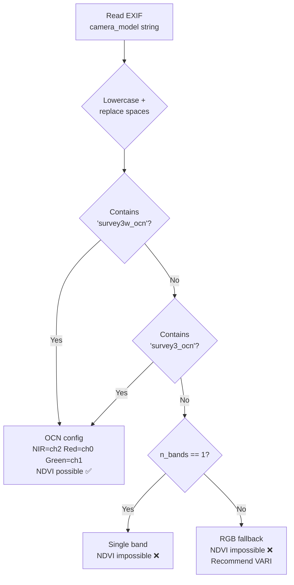

#### `MAPIR_BAND_MAP` Dictionary

```python
MAPIR_BAND_MAP = {
    "survey3w_ocn": {
        "description": "MAPIR Survey3W OCN (Orange-Cyan-NIR)",
        "channels": {
            "Red":   {"channel_index": 0, "wavelength_nm": 650},
            "Green": {"channel_index": 1, "wavelength_nm": 550},
            "NIR":   {"channel_index": 2, "wavelength_nm": 850},
        },
        "ndvi_possible": True,
        "recommended_vi": "NDVI",
    },
    "rgb_fallback": {
        "description": "Standard RGB (no NIR band)",
        # ... Red=0, Green=1, Blue=2 ...
        "ndvi_possible": False,
        "recommended_vi": "VARI",
    },
}
```

#### Image Loading Strategy

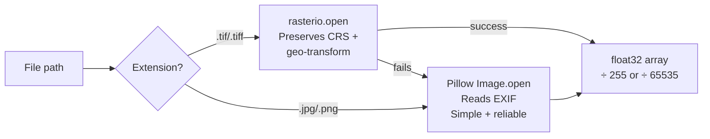

> 💡 **Why both?** Rasterio is used for GeoTIFF because it preserves geolocation metadata needed in Phase 7 to write a properly geo-referenced output. Pillow is used for JPEG because it provides EXIF access and handles the RGB colour mode cleanly.

---

### Phase 2 · Preprocessing

> **Goal:** Reduce sensor noise and improve local contrast so that the segmentation thresholds in Phase 3 work reliably.

#### Processing Order

```
arr_orig
   │
   ▼
[maybe_resize]   ← Only if width > 4096 px
   │             Uses INTER_AREA (anti-aliased downsampling)
   ▼
[remove_noise]   ← Non-Local Means, h=10
   │             ~30s for 12MP image
   │             Best edge preservation of all denoisers
   ▼
[apply_clahe]    ← Per-channel, clip=2.0, grid=8×8
   │             Improves local contrast in shadowed areas
   ▼
[radiometric_check]  ← Diagnostics only, no modification
   │             Warns about saturation, near-zero, NIR<Red
   ▼
arr_pre
```

#### 📊 Denoiser Comparison

| Method | Edge Preservation | Noise Removal | Speed (12MP) | Memory |
|--------|:-----------------:|:-------------:|:------------:|:------:|
| **Non-Local Means** ← *used* | ⭐⭐⭐⭐⭐ | ⭐⭐⭐⭐⭐ | 🐢 ~30s | Medium |
| Bilateral filter | ⭐⭐⭐⭐ | ⭐⭐⭐ | 🐇 ~1s | Low |
| Gaussian blur | ⭐⭐ | ⭐⭐⭐ | 🚀 <0.1s | Low |
| BM3D | ⭐⭐⭐⭐⭐ | ⭐⭐⭐⭐⭐ | 🐢🐢 >60s | High |
| Wavelet (skimage) | ⭐⭐⭐⭐ | ⭐⭐⭐⭐ | 🐇 ~2s | Medium |

> ⚠️ **Performance Note:** NLM is the bottleneck. To speed up batch processing, replace with bilateral filter (see [Extension Guide](#15--extension-guide)). Quality drops slightly but processing becomes ~30× faster.

#### CLAHE — What It Does

```
BEFORE CLAHE (dark shadowed region):
  Pixel values: 40, 42, 41, 43, 40, 44 ...  (compressed around 40-50)

Image divided into 8×8 = 64 tiles:
  Each tile: local histogram computed → stretched to fill 0-255
  Tiles blended at borders (bilinear interpolation)

AFTER CLAHE:
  Pixel values: 80, 95, 85, 100, 82, 110 ... (spread across wider range)
  The same leaf tissue is now distinguishable from the shadow
```

> 📌 **Mathematical Intuition:** CLAHE maps pixel intensities using the cumulative distribution function (CDF) of the local tile's histogram. The "clip limit" prevents over-stretching in near-uniform regions by redistributing histogram bins above the clip threshold to all bins uniformly.

---

### Phase 3 · Leaf Segmentation

> **Goal:** Build a precise binary mask that marks every wheat leaf pixel as True and everything else as False.

#### Why Classical CV, Not Deep Learning

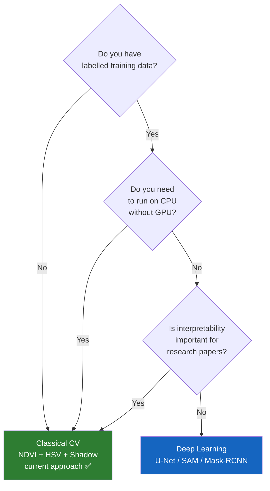

#### Three-Cue Segmentation Logic

```
┌─────────────────────────────────────────────────────────────────┐
│  CUE A — NDVI THRESHOLD                                         │
│  NDVI = (NIR − Red) / (NIR + Red + ε) > 0.06                   │
│  Principle: vegetation reflects NIR, absorbs Red                │
│  Catches:   ✅ wheat leaves    ❌ soil  ❌ stones  ❌ straw    │
│  Misses:    🌑 shadows (NDVI unreliable)  🔲 glare panels      │
├─────────────────────────────────────────────────────────────────┤
│  CUE B — HSV COLOUR FILTER                                      │
│  Hue ∈ [120, 179]  Saturation ∈ [30, 255]  Value ∈ [100, 255] │
│  Principle: leaves appear purple/magenta in OCN false-colour    │
│  Catches:   ✅ wheat leaves    ❌ white panels  ❌ sky         │
│  Misses:    🌑 shadows (low Value)                              │
├─────────────────────────────────────────────────────────────────┤
│  CUE C — SHADOW EXCLUSION                                       │
│  HSV Value ≥ 80                                                 │
│  Principle: shadows produce unreliable NDVI (noise-dominated)   │
│  Catches:   🌑 shadow pixels to EXCLUDE                        │
└─────────────────────────────────────────────────────────────────┘

Final mask = Cue A  AND  Cue B  AND  Cue C
```

> 📌 **Why AND instead of OR?**
> OR would accept any pixel passing *any* cue — too permissive, includes soil with fortuitous hue or slightly high NDVI.
> AND requires *all three cues* to agree — more conservative, fewer false positives.
> With 9.26% of pixels retained, the precision is high.

#### Morphological Cleanup — Step by Step

```
Step 1: Combined boolean mask (noise + gaps + real leaves)
  ██░░██░░░░██████░░░░███░░░░░░██████████░░░░

Step 2: MORPH_OPEN with 5×5 ellipse (×2 iterations)
  ← removes isolated noise specks
  ░░░░░░░░░░░░██████░░░░███░░░░░░██████████░░░

Step 3: MORPH_CLOSE with 9×9 ellipse (×2 iterations)
  ← fills small internal holes
  ░░░░░░░░░░░░████████░░░██████░░░██████████░░

Step 4: Drop components < 300 px
  ← removes remaining pepper noise
  ░░░░░░░░░░░░████████░░░░░░░░░░░░████████░░░░
```

#### Why Ellipse, Not Rectangle, As Structuring Element?

```
Rectangle kernel:           Ellipse kernel:
■ ■ ■ ■ ■                  · ■ ■ ■ ·
■ ■ ■ ■ ■                  ■ ■ ■ ■ ■
■ ■ ■ ■ ■                  ■ ■ ■ ■ ■
■ ■ ■ ■ ■                  ■ ■ ■ ■ ■
■ ■ ■ ■ ■                  · ■ ■ ■ ·

Rectangle: erodes corners   Ellipse: isotropic — erodes
more than sides → distorts  equally in all directions
circular/organic shapes     → better for leaf shapes
```

---

### Phase 4 · Background Removal

> **Goal:** Produce an image containing *only* leaf pixels, with all other pixels set to exactly 0.0.

```python
# Implementation
leaf_image = arr.copy()
for c in range(arr.shape[2]):
    leaf_image[:, :, c] = np.where(mask, arr[:, :, c], 0.0)
```

**Why zero and not NaN?**

```
If background = NaN:
  NDVI formula: (0.0 - NaN) / (0.0 + NaN + eps) = NaN
  NaN propagates → entire VI map becomes NaN
  
If background = 0.0:
  NDVI formula: (0.0 - 0.0) / (0.0 + 0.0 + 1e-8) ≈ 0.0
  Near-zero values in background → safe
  Phase 5 uses the mask again to select only real leaf pixels for the mean
  Non-leaf zeros are NOT included in avg_vi
```

---

### Phase 5 · Vegetation Index Computation

> **Goal:** Compute a per-pixel plant health score using the correct formula for this sensor, then aggregate to a single meaningful scalar.

#### VI Selection Logic

```mermaid
flowchart TD
    A[Read vi_mode from config] --> B{vi_mode == 'NDVI'?}
    B -- Yes --> C{ndvi_possible\nin band_cfg?}
    C -- Yes --> D[compute_ndvi\nNIR ch=2 Red ch=0]
    C -- No --> E[⚠️ Fallback to VARI\nlog warning]
    B -- No --> F{vi_mode in\nVI_FUNCTIONS?}
    F -- Yes --> G[Use requested VI\nVARI / ExG / GLI]
    F -- No --> H[⚠️ Unknown VI\nDefault to NDVI]
    
    D --> I[vi_full: (H,W) float32\nall pixels incl. background]
    E --> I
    G --> I
    H --> I
    
    I --> J[vi_map = full_like NaN]
    J --> K[vi_map mask = vi_full mask]
    K --> L[avg_vi = nanmean over leaf pixels]
```

#### 📊 Vegetation Index Comparison

| Index | Formula | NIR Required | Range | Best For | Saturates? |
|-------|---------|:------------:|-------|----------|:----------:|
| **NDVI** ← *default* | (NIR−R)/(NIR+R) | ✅ | [−1, 1] | General vegetation health | At high biomass |
| VARI | (G−R)/(G+R−B) | ❌ | ≈[−1,1] | RGB cameras, atmospheric correction | Less so |
| ExG | 2G − R − B | ❌ | Unbounded | Fast vegetation mask | N/A |
| GLI | (2G−R−B)/(2G+R+B) | ❌ | [−1, 1] | Field scenes, stable lighting | No |
| EVI | G·(NIR−R)/(NIR+C₁R−C₂B+L) | ✅ | [−1, 1] | Dense canopies | No |
| NDRE | (NIR−RedEdge)/(NIR+RedEdge) | ✅+RedEdge | [−1, 1] | Chlorophyll stress | No |

#### NDVI Mathematical Derivation

```
Plant physiology → Spectral physics → NDVI formula

1. Chlorophyll absorbs Red light (~660 nm) for photosynthesis
   → Reflected Red is LOW for healthy leaves

2. Leaf cell structure (mesophyll air spaces) reflects NIR (~850 nm)
   → Reflected NIR is HIGH for healthy leaves

3. Contrast measure:
   NDVI = (NIR − Red) / (NIR + Red)
        = large_positive / larger_positive
        ≈ 0.6 to 0.9  for healthy dense canopy
        ≈ 0.0 to 0.1  for bare soil (both reflect similarly)
        ≈ −0.1 to −0.5 for water (absorbs NIR strongly)

4. Numerical stability:
   Add ε = 1e-8 to denominator:
   NDVI = (NIR − Red) / (NIR + Red + 1e-8)
   This prevents division by zero at pitch-black pixels.
```

> 🔬 **Real-world analogy:** Imagine measuring stress in a plant like measuring the colour of a person's face. A healthy person has good circulation (high NIR equivalent) while a sick person looks pale (low NIR equivalent). NDVI is the instrument that quantifies this difference.

---

### Phase 6 · Visualisation

> **Goal:** Produce a publication-ready 6-panel diagnostic figure that a researcher can immediately interpret.

#### 6-Panel Layout

```
┌───────────────────┬───────────────────┬───────────────────┐
│                   │                   │                   │
│  ① Original       │  ② Leaf Mask      │  ③ Leaf Only      │
│  (CIR Display)    │  (white = leaf)   │  (bkg zeroed)     │
│                   │                   │                   │
├───────────────────┼───────────────────┼───────────────────┤
│                   │                   │                   │
│  ④ NDVI Heatmap   │  ⑤ VI Histogram   │  ⑥ Statistics     │
│  (RdYlGn cmap)    │  (coloured bars)  │  (text panel)     │
│                   │                   │                   │
└───────────────────┴───────────────────┴───────────────────┘
Background: #1a1a2e (deep navy)
Panel bg:   #16213e (slightly lighter)
All text:   white / lightcyan
```

#### CIR (Colour Infrared) Display — Why It Looks Red

```
Raw OCN image:
  JPEG R channel = Orange/Red (~650 nm)   → humans see RED
  JPEG G channel = Cyan/Green (~550 nm)   → humans see GREEN
  JPEG B channel = NIR (~850 nm)          → humans see BLUE + NIR = PURPLE
  Result: purple/magenta image (confusing)

CIR composite (ocn_to_display_rgb):
  Display R ← sensor Red band   (ch 0)
  Display G ← sensor Green band (ch 1)
  Display B ← sensor NIR band   (ch 2)
  
  Plants reflect NIR strongly → high B channel → magenta/red appearance
  Soil reflects NIR less → lower B → darker
  Water absorbs NIR → very dark blue
  
  Result: standard CIR — remote sensing professionals immediately understand it
```

---

### Phase 7 · Save Outputs

> **Goal:** Persist all results in formats useful to researchers, GIS software, and downstream data analysis.

#### Output Decision Tree

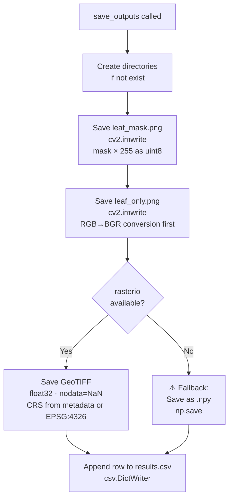

> ⚠️ **Critical OpenCV gotcha:**
> OpenCV (`cv2.imwrite`) uses **BGR** channel order, not RGB.
> The pipeline stores images in **RGB** order (as returned by Pillow).
> Before writing `leaf_only.png`, the code converts:
> ```python
> leaf_bgr = cv2.cvtColor(leaf_u8, cv2.COLOR_RGB2BGR)
> cv2.imwrite(str(leaf_path), leaf_bgr)
> ```
> Without this conversion, red and blue channels are swapped in the saved file.

---

## 9 · Vegetation Index Selection

### Decision Tree for VI Selection

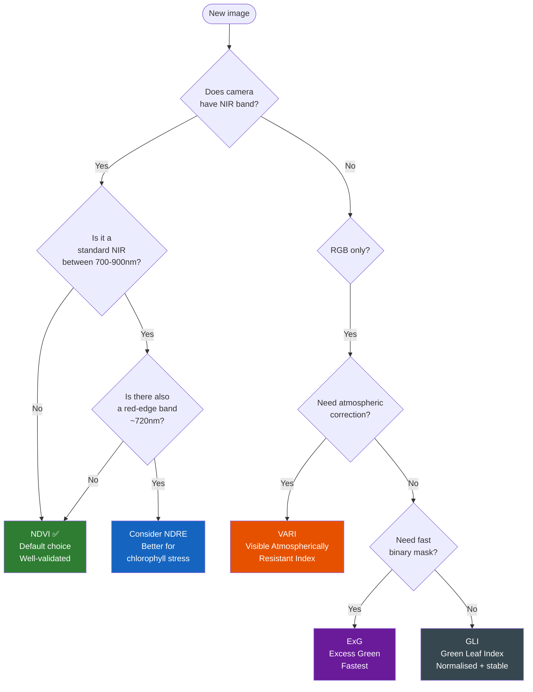

---

### Full VI Formula Reference

```
┌───────┬─────────────────────────────────────────────────────────────────┐
│ NDVI  │ (NIR − Red) / (NIR + Red + ε)                                  │
│       │ Range: [−1, 1]   Values > 0.3 typically healthy vegetation      │
│       │ Needs: NIR + Red bands                                          │
├───────┼─────────────────────────────────────────────────────────────────┤
│ VARI  │ (Green − Red) / (Green + Red − Blue + ε)                       │
│       │ Range: ≈ [−1, 1]   Works in atmospherically-hazy conditions     │
│       │ Needs: RGB only                                                 │
├───────┼─────────────────────────────────────────────────────────────────┤
│ ExG   │ 2·Green − Red − Blue                                            │
│       │ Range: unbounded   Simple, fast, good for binary mask creation  │
│       │ Needs: RGB only                                                 │
├───────┼─────────────────────────────────────────────────────────────────┤
│ GLI   │ (2·Green − Red − Blue) / (2·Green + Red + Blue + ε)            │
│       │ Range: [−1, 1]   Normalised version of ExG                     │
│       │ Needs: RGB only                                                 │
└───────┴─────────────────────────────────────────────────────────────────┘
```

---

## 10 · Segmentation Strategy

### Classical CV vs Deep Learning — Full Comparison

| Factor | Classical CV (current) | U-Net / DeepLab | Mask R-CNN | SAM (Meta) |
|--------|:----------------------:|:---------------:|:----------:|:----------:|
| Training data needed | None ✅ | 100s of labels | 1000s of labels | None (zero-shot) |
| GPU required | No ✅ | Yes | Yes | Yes (or slow) |
| Speed (12MP, CPU) | ~46s | >5 min | >10 min | ~30s |
| Accuracy (calibrated) | Good | Potentially better | Best | Comparable |
| Interpretability | Full ✅ | Limited | Limited | Limited |
| Reproducibility | Deterministic ✅ | Model dependent | Model dependent | Model dependent |
| Code complexity | Low ✅ | High | High | Medium |
| Research publishable | Yes, straightforward | Needs ablation study | Needs ablation | Newer, growing |

> ✅ **Recommendation:** Classical CV is the correct choice for this project's constraints (no labels, CPU-only, research context). SAM would be the best DL upgrade path since it requires no training data.

---

### Segmentation Threshold Sensitivity

```
ndvi_threshold impact:

  0.00 → selects ~60% pixels (over-inclusive, lots of soil)
  0.02 → selects ~45% pixels
  0.04 → selects ~20% pixels
  0.06 → selects  ~9% pixels ← current config (calibrated)
  0.10 → selects  ~3% pixels
  0.15 → selects  ~1% pixels (under-inclusive, misses sparse leaves)

HSV range impact (for OCN purple false-colour):
  Hue [100–179] → wider, catches more but more false positives
  Hue [120–179] → balanced ← current config
  Hue [140–179] → narrower, misses some leaf hues
```

---

## 11 · Library Reference

### Complete Dependency Map

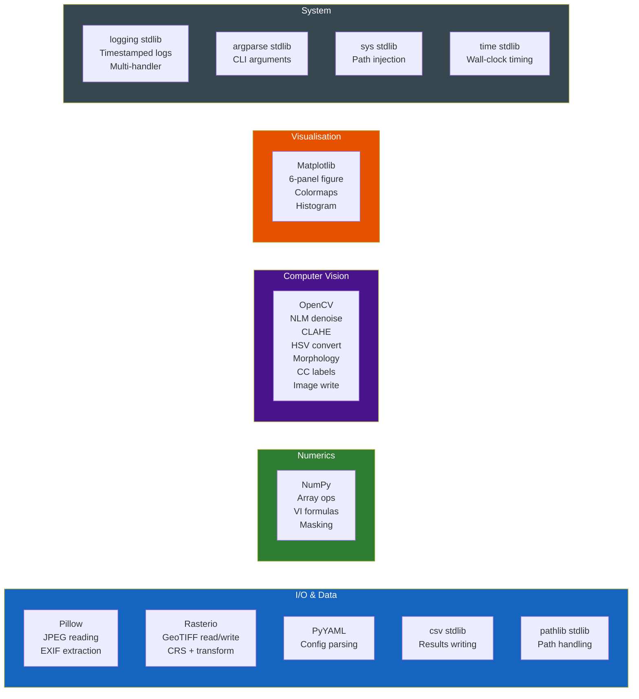

---

### Library Deep Dives

#### NumPy

| Aspect | Detail |
|--------|--------|
| **Why chosen** | Foundation of all scientific Python; every image is an ndarray |
| **Key operations** | Element-wise arithmetic for VI formulas; boolean indexing (`arr[mask]`); `np.where` for background removal; `np.nanmean` for leaf-only average |
| **dtype strategy** | Store as float32 [0,1]; compute VI as float64 to avoid precision loss; return float32 |
| **Alternative** | PyTorch tensors for GPU; Dask for out-of-core |
| **Why not alternative** | No GPU needed; images fit in RAM |

#### OpenCV (`cv2`)

| Aspect | Detail |
|--------|--------|
| **Why chosen** | Fastest CPU implementations of NLM, CLAHE, morphology, HSV conversion |
| **⚠️ Critical gotcha** | Default channel order is **BGR not RGB**. Use `COLOR_RGB2HSV` not `COLOR_BGR2HSV`. Convert to BGR before `cv2.imwrite`. |
| **Installed as** | `opencv-python-headless` — no GUI dependencies (safe for servers) |
| **Alternative** | scikit-image (pure Python, slower); Pillow (simpler but less capable) |
| **Why not alternative** | scikit-image's NLM is 2–3× slower than OpenCV's C++ implementation |

#### Rasterio

| Aspect | Detail |
|--------|--------|
| **Why chosen** | Only Python library that reads/writes GeoTIFF with proper CRS, transform, and nodata handling |
| **Use in Phase 1** | `rasterio.open()` for TIFF input → preserves `src.crs` and `src.transform` |
| **Use in Phase 7** | Write float32 single-band TIFF with `nodata=np.nan` |
| **Fallback** | `np.save()` as `.npy` if rasterio fails |
| **Installation issues** | macOS Apple Silicon: needs `brew install gdal` first |

#### Matplotlib

| Aspect | Detail |
|--------|--------|
| **Backend** | `matplotlib.use("Agg")` — non-interactive, renders to file without display |
| **Layout** | `GridSpec(2, 3)` with custom spacing parameters |
| **Colormap** | `RdYlGn` (Red–Yellow–Green): red = low VI, green = high VI |
| **Dark theme** | `facecolor="#1a1a2e"` (figure), `#16213e` (axes) — professional presentation |
| **Alternative** | Plotly (interactive); PIL compositing (faster, less flexible) |

---

## 12 · Configuration Reference

### `config/config.yaml` — Complete Reference

```yaml
# ─── I/O ──────────────────────────────────────────────
input_dir:  "input"    # Source directory (batch mode)
output_dir: "output"   # Root of all output subdirectories

# ─── Camera / Band Mapping ────────────────────────────
camera_model: "MAPIR Survey3W OCN"   # Informational only
bands:
  NIR_channel:   2    # JPEG blue  → NIR   (~850 nm)
  Green_channel: 1    # JPEG green → Cyan  (~550 nm)
  Red_channel:   0    # JPEG red   → Orange/Red (~650 nm)

# ─── Vegetation Index ─────────────────────────────────
vi_mode: "NDVI"    # NDVI | VARI | ExG | GLI

# ─── Preprocessing ────────────────────────────────────
denoise_h:        10        # NLM strength: 5=subtle, 15=heavy
clahe_clip_limit: 2.0       # CLAHE aggressiveness: 1=mild, 4=strong
clahe_tile_grid:  [8, 8]    # Tile size: smaller=more local

# ─── Segmentation ─────────────────────────────────────
ndvi_threshold:   0.06      # NDVI lower bound for leaf candidates
hsv_green_lower:  [120, 30, 100]   # [Hue, Sat, Val] minimum
hsv_green_upper:  [179, 255, 255]  # [Hue, Sat, Val] maximum
shadow_v_min:     80        # Min HSV Value (brightness)
min_leaf_area_px: 300       # Min connected component size

# ─── Visualisation ────────────────────────────────────
colormap: "RdYlGn"    # Matplotlib colormap name
dpi:      150         # Figure resolution (pixels per inch)

# ─── Batch ────────────────────────────────────────────
extensions: [".tif", ".tiff", ".jpg", ".jpeg", ".png"]
```

---

### Tuning Guide

```
Problem: Too few leaf pixels detected (< 3%)
─────────────────────────────────────────────
  ① Lower ndvi_threshold: 0.06 → 0.02
  ② Widen HSV hue range: lower[0] → 100, or upper[0] stays 179
  ③ Lower shadow_v_min: 80 → 50
  ④ Lower min_leaf_area_px: 300 → 100

Problem: Too many non-leaf pixels included
────────────────────────────────────────────
  ① Raise ndvi_threshold: 0.06 → 0.12
  ② Narrow HSV range: lower[0] → 130
  ③ Raise min_leaf_area_px: 300 → 800

Problem: Processing too slow
─────────────────────────────
  ① Lower denoise_h: 10 → 5  (biggest impact)
  ② Or replace NLM with bilateral filter in code

Problem: Output blurry
────────────────────────
  ① Lower denoise_h: 10 → 3
  ② Lower clahe_clip_limit: 2.0 → 1.0
```

---

## 13 · Error Handling Map

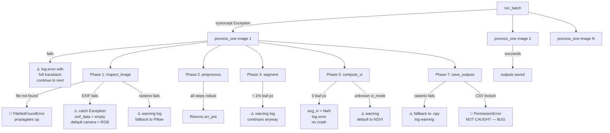

### Error Handling Summary Table

| Error Type | Location | Caught? | Recovery |
|-----------|---------|:-------:|---------|
| `FileNotFoundError` (image missing) | phase1_inspect | ❌ | Caught by `run_batch`, logged, next image tried |
| EXIF read failure | phase1_inspect | ✅ | Empty EXIF, falls back to RGB config |
| rasterio read failure | phase1_inspect | ✅ | Falls back to Pillow |
| Zero leaf pixels | phase45_vi | ✅ | `avg_vi = NaN`, continues |
| Unknown `vi_mode` | phase45_vi | ✅ | Falls back to NDVI |
| rasterio write failure | phase67_output | ✅ | Falls back to `.npy` |
| CSV file locked | phase67_output | ❌ 🐛 | `PermissionError` — **bug, not caught** |
| Per-image exception in batch | main.py | ✅ | Logged, next image processed |

---

## 14 · Outputs Reference

### Output Files Explained

```
output/
├── masks/
│   ├── {stem}_leaf_mask.png
│   │     Format  : PNG, 8-bit, single channel
│   │     Values  : 0 = background, 255 = wheat leaf
│   │     Size    : 4000×3000 for demo image
│   │     Use     : Visual QC; can be used as mask in GIS or Python
│   │
│   └── {stem}_leaf_only.png
│         Format  : PNG, 8-bit, 3 channels (BGR — OpenCV convention)
│         Values  : Original pixel values where mask=True, 0 elsewhere
│         Use     : Visual confirmation of correct segmentation
│
├── vi_maps/
│   └── {stem}_{VI}_map.tif
│         Format  : GeoTIFF, float32, 1 band
│         Values  : VI value where mask=True, NaN elsewhere
│         nodata  : NaN
│         CRS     : From input GeoTIFF, or EPSG:4326 placeholder
│         Use     : Load in QGIS, ArcGIS, ENVI, or Python for analysis
│
├── csv/
│   └── results.csv
│         Mode    : Append (header written only on first run)
│         Columns : filename · vi_name · avg_vi · leaf_px ·
│                   total_px · leaf_pct · camera_model · n_bands
│         Example :
│         5feb_1_MSI_A930,NDVI,0.104758,1111364,12000000,9.2614,Survey3W_OCN,3
│
└── visualizations/
    └── {stem}_visualization.png
          Format  : PNG, ~2700×1650 pixels
          DPI     : 150
          Content : 6-panel figure (see Phase 6 section)
          Use     : Reports, presentations, quick QC
```

---

### GeoTIFF Output — How to Use It

```python
# In Python with rasterio
import rasterio
import numpy as np
import matplotlib.pyplot as plt

with rasterio.open("output/vi_maps/5feb_1_MSI_A930_NDVI_map.tif") as src:
    ndvi = src.read(1)               # Band 1
    ndvi[ndvi == src.nodata] = np.nan  # Treat nodata as NaN
    transform = src.transform        # For geo-referencing
    crs = src.crs                    # Coordinate system

# Plot
plt.imshow(ndvi, cmap="RdYlGn", vmin=-0.2, vmax=0.9)
plt.colorbar(label="NDVI")
plt.title(f"Mean: {np.nanmean(ndvi):.4f}")
plt.show()
```

---

## 15 · Extension Guide

### 15.1 Add a New Vegetation Index

**Step 1:** Write the formula function in `src/phase45_vi.py`:

```python
def compute_myindex(arr: np.ndarray, band_cfg: Dict) -> np.ndarray:
    """
    MyIndex = (NIR - Green) / (NIR + Green + ε)
    Useful for: detecting plant water stress
    """
    channels = band_cfg["channels"]
    nir = arr[:, :, channels["NIR"]["channel_index"]].astype(np.float64)
    grn = arr[:, :, channels["Green"]["channel_index"]].astype(np.float64)
    eps = 1e-8
    vi = (nir - grn) / (nir + grn + eps)
    return np.clip(vi, -1.0, 1.0).astype(np.float32)
```

**Step 2:** Register it in `VI_FUNCTIONS`:

```python
VI_FUNCTIONS = {
    "NDVI":    compute_ndvi,
    "VARI":    compute_vari,
    "ExG":     compute_exg,
    "GLI":     compute_gli,
    "MYINDEX": compute_myindex,   # ← add this line
}
```

**Step 3:** Use it:

```yaml
# config/config.yaml
vi_mode: "MYINDEX"
```

That's it. No other changes needed.

---

### 15.2 Support a New Camera

Add an entry to `MAPIR_BAND_MAP` in `src/phase1_inspect.py`:

```python
"mycamera_model_name": {
    "description": "My Camera (description of filters)",
    "channels": {
        "Red":   {"channel_index": 0, "wavelength_nm": 660},
        "Green": {"channel_index": 1, "wavelength_nm": 550},
        "NIR":   {"channel_index": 2, "wavelength_nm": 840},
    },
    "ndvi_possible": True,
    "recommended_vi": "NDVI",
},
```

The key must be a lowercase, underscore-replaced substring of the camera's EXIF `Model` tag. Check what string your camera writes:

```python
from PIL import Image, ExifTags
img = Image.open("your_image.jpg")
exif = {ExifTags.TAGS.get(k,k): v for k, v in (img._getexif() or {}).items()}
print(exif.get("Model"))  # ← this is what to match
```

---

### 15.3 Replace NLM with Bilateral Filter (Speed)

In `src/phase2_preprocess.py`, change `remove_noise`:

```python
def remove_noise(arr: np.ndarray, h: float = 10) -> np.ndarray:
    """Fast bilateral filter — ~30× faster than NLM, slightly lower quality."""
    u8 = (arr * 255).clip(0, 255).astype(np.uint8)
    if u8.shape[2] == 3:
        # d=9: pixel neighbourhood diameter
        # sigmaColor=75: filter strength in colour space
        # sigmaSpace=75: filter strength in spatial space
        denoised = cv2.bilateralFilter(u8, d=9, sigmaColor=75, sigmaSpace=75)
    else:
        denoised = cv2.bilateralFilter(u8[:,:,0], d=9, sigmaColor=75, sigmaSpace=75)
        denoised = denoised[:, :, np.newaxis]
    return denoised.astype(np.float32) / 255.0
```

Processing time drops from ~30s to ~1s with moderate quality reduction.

---

### 15.4 Add Deep Learning Segmentation (SAM)

Replace `segment_leaves` in `src/phase3_segment.py`:

```python
def segment_leaves(arr: np.ndarray, band_cfg: Dict, cfg: Dict):
    """
    SAM-based segmentation + NDVI filter.
    Install: pip install segment-anything
    Download: SAM ViT-B checkpoint from Meta
    """
    from segment_anything import sam_model_registry, SamAutomaticMaskGenerator
    
    sam = sam_model_registry["vit_b"](checkpoint=cfg["sam_checkpoint"])
    sam.to(device="cuda" if torch.cuda.is_available() else "cpu")
    
    generator = SamAutomaticMaskGenerator(
        sam,
        points_per_side=32,
        pred_iou_thresh=0.86,
        stability_score_thresh=0.92,
    )
    
    # SAM works on uint8 RGB
    u8 = (arr[:,:,:3] * 255).astype(np.uint8)
    masks_data = generator.generate(u8)
    
    # Filter SAM masks using NDVI to keep only vegetation
    ndvi = compute_raw_ndvi(arr, band_cfg)
    final_mask = np.zeros(arr.shape[:2], dtype=bool)
    
    for mask_dict in masks_data:
        seg = mask_dict["segmentation"]  # bool array
        ndvi_in_region = ndvi[seg]
        if ndvi_in_region.mean() > 0.05:  # mostly vegetation
            final_mask |= seg
    
    return final_mask, ndvi
```

---

### 15.5 Parallel Batch Processing

```python
# In main.py — replace run_batch()
from concurrent.futures import ThreadPoolExecutor, as_completed

def run_batch(cfg: dict) -> None:
    in_dir = Path(cfg.get("input_dir", "input"))
    extensions = cfg.get("extensions", [".jpg", ".tif", ".png"])
    files = sorted(f for f in in_dir.iterdir()
                   if f.is_file() and f.suffix.lower() in extensions)
    
    if not files:
        logger.warning(f"No images found in '{in_dir}'.")
        return
    
    max_workers = cfg.get("parallel_workers", 2)
    logger.info(f"Batch mode: {len(files)} images, {max_workers} workers")
    
    with ThreadPoolExecutor(max_workers=max_workers) as executor:
        future_to_fp = {executor.submit(process_one, str(fp), cfg): fp
                        for fp in files}
        for future in as_completed(future_to_fp):
            fp = future_to_fp[future]
            try:
                future.result()
            except Exception as e:
                logger.error(f"Failed on {fp.name}: {e}", exc_info=True)
```

> 📌 OpenCV releases the Python GIL during its C++ operations (NLM, CLAHE, morphology), so threads provide real parallelism here. Memory usage scales linearly: 2 workers × 144 MB ≈ 288 MB minimum.

---

### 15.6 Add a Progress Bar for Batch Mode

```python
from tqdm import tqdm  # already in requirements.txt

for fp in tqdm(files, desc="Processing images", unit="img"):
    try:
        process_one(str(fp), cfg)
    except Exception as e:
        logger.error(f"Failed on {fp.name}: {e}", exc_info=True)
```

---

## 16 · Frequently Asked Questions

<details>
<summary><b>Installation & Setup</b></summary>

**Q1. How do I install all dependencies?**
```bash
pip install -r requirements.txt
```
On macOS Apple Silicon, rasterio needs GDAL first:
```bash
brew install gdal
pip install rasterio
```

**Q2. Why does `pip install -r requirements.txt` install packages I never see used (scikit-image, scikit-learn, tqdm)?**
These are in the requirements file in anticipation of planned extensions (scikit-image for alternative morphology, scikit-learn for clustering segmentation, tqdm for progress bars). They are not currently used in the source code. This is a minor inconsistency — they should either be implemented or removed.

**Q3. Can I run this without rasterio?**
Yes. The pipeline falls back gracefully: Phase 1 uses Pillow for TIFF, Phase 7 saves the VI map as `.npy` instead of GeoTIFF. You lose geospatial metadata but keep all numeric results.

</details>

<details>
<summary><b>Running the Pipeline</b></summary>

**Q4. How do I run on a single image?**
```bash
python main.py --input input/my_image.jpg
```

**Q5. How do I run on all images in the input folder?**
```bash
python main.py --batch
```

**Q6. How do I use a different config file?**
```bash
python main.py --input image.jpg --config config/my_custom_config.yaml
```

**Q7. What if I run with no arguments?**
The pipeline automatically finds the first image in the `input/` directory (sorted alphabetically) and processes it. This is the "demo mode."

**Q8. Can I run from a Jupyter notebook?**
```python
import sys, yaml
sys.path.insert(0, "/path/to/wheat_vi_pipeline")
from src.phase1_inspect import inspect_image
from src.phase2_preprocess import preprocess
# ... etc.

with open("config/config.yaml") as f:
    cfg = yaml.safe_load(f)

arr, metadata, band_cfg = inspect_image("input/my_image.jpg")
```

</details>

<details>
<summary><b>Camera & Bands</b></summary>

**Q9. Why does my image look purple?**
The MAPIR Survey3W OCN stores NIR energy in the JPEG blue channel. Since plants reflect NIR very strongly, the blue channel is very bright, making everything appear purple/magenta. This is the correct camera output. The pipeline knows about this and handles it correctly.

**Q10. My camera isn't in the `MAPIR_BAND_MAP`. What do I do?**
Check your camera's EXIF model string:
```python
from PIL import Image, ExifTags
img = Image.open("my_image.jpg")
exif = {ExifTags.TAGS.get(k,k): v for k, v in (img._getexif() or {}).items()}
print(exif.get("Model"))
```
Then add a new entry to `MAPIR_BAND_MAP` in `src/phase1_inspect.py` with the correct channel assignments for your camera.

**Q11. The log says "Camera model not recognised. Defaulting to RGB." Is something wrong?**
Not necessarily. The pipeline will still run using RGB mode and VARI as the vegetation index. NDVI won't be computed because the NIR band can't be identified. To fix: add your camera to `MAPIR_BAND_MAP`.

**Q12. The log says "NIR mean ≤ Red mean." Is something wrong?**
For a vegetated scene, NIR reflectance should exceed Red reflectance. If this check fails, either:
- The `bands.NIR_channel` and `bands.Red_channel` assignments in config.yaml are wrong
- The scene is dominated by bare soil or non-vegetated material
- The image has unusual lighting

Check `config.yaml` band assignments.

</details>

<details>
<summary><b>Segmentation & Results</b></summary>

**Q13. Only 0% leaf pixels detected. What's wrong?**
This happened in the first pipeline run in the logs (before the band config was fixed). Check:
1. Are `bands.NIR_channel` and `bands.Red_channel` correct for your camera?
2. Is `ndvi_threshold` too high? Try lowering to 0.02.
3. Are the `hsv_green_lower/upper` values right for your camera's colour rendering?

**Q14. What does NDVI = 0.1048 mean for wheat?**
| NDVI Range | Interpretation |
|-----------|---------------|
| 0.8 – 1.0 | Very dense healthy canopy (unreachable for sparse plots) |
| 0.5 – 0.8 | Healthy, dense vegetation |
| 0.3 – 0.5 | Moderate vegetation cover |
| 0.1 – 0.3 | Sparse or mildly stressed vegetation |
| 0.0 – 0.1 | Very sparse, stressed, or early-stage growth |
| < 0.0 | Soil, water, bare surfaces |

0.1048 suggests either early growth stage, low canopy density, or mild stress. Compare to reference measurements from the same variety at the same growth stage.

**Q15. Can I validate the segmentation?**
Label some pixels manually in `labelme` or CVAT, export as a binary mask, then:
```python
from sklearn.metrics import jaccard_score
# Load your ground truth mask and the pipeline mask
iou = jaccard_score(ground_truth.flatten(), pipeline_mask.flatten())
print(f"IoU: {iou:.3f}")  # > 0.7 is typically acceptable
```

**Q16. How do I know if the segmentation threshold is correctly calibrated?**
Look at `leaf_pct` in the CSV results. For a typical wheat field image:
- Dense field: 30–60% coverage expected
- Sparse/early growth: 5–15% coverage expected
- If < 1%: threshold too strict
- If > 70%: threshold too loose (including soil/background)

</details>

<details>
<summary><b>Outputs & Files</b></summary>

**Q17. How do I open the GeoTIFF output?**
```python
import rasterio, numpy as np
with rasterio.open("output/vi_maps/5feb_1_MSI_A930_NDVI_map.tif") as src:
    ndvi = src.read(1)
    ndvi[ndvi == src.nodata] = np.nan
```
Or open in QGIS: `Layer → Add Layer → Add Raster Layer → select .tif`.

**Q18. The leaf_only.png has swapped red/blue channels. Why?**
OpenCV writes images in BGR order, not RGB. The code includes `cv2.cvtColor(leaf_u8, cv2.COLOR_RGB2BGR)` before `cv2.imwrite`. If you're seeing wrong colours, check that this conversion is present.

**Q19. If I run the pipeline twice on the same image, what happens?**
- Output PNGs and TIFFs are **overwritten** (same filename)
- `results.csv` gets a **second row** appended (same filename, new result)
- `pipeline.log` **accumulates** entries from both runs

**Q20. How do I reset the results.csv?**
Simply delete it: `rm output/csv/results.csv`. The next run will create a fresh file with a new header.

</details>

<details>
<summary><b>Performance</b></summary>

**Q21. Processing takes 46 seconds. Can I make it faster?**
The NLM denoiser takes ~30s of that. Replace it with bilateral filter (see Extension Guide §15.3) to get total time under 5 seconds with moderate quality trade-off.

**Q22. How much RAM does the pipeline need?**
For a 4000×3000×3 image:
- Main array (float32): 144 MB
- Denoiser working buffers: ~50 MB
- Mask (bool): 12 MB  
- VI map (float32): 48 MB
- Matplotlib figure: ~50 MB
- **Total peak: ~400–500 MB**

**Q23. Can I run it on a server without a display?**
Yes. `matplotlib.use("Agg")` is called at module import time in `phase67_output.py`, which disables the display requirement. The pipeline runs headlessly on any server.

**Q24. Can I process images larger than 4096 pixels wide?**
Yes — the `maybe_resize` function automatically scales them down. Change `max_width=4096` in `preprocess()` if you want to allow larger images (at proportionally more RAM and time cost).

</details>

<details>
<summary><b>Design Decisions</b></summary>

**Q25. Why is NLM denoising applied before NDVI computation?**
Sensor noise in the NIR and Red channels produces noise in their difference. Since NDVI = (NIR − Red)/(NIR + Red), noise in both channels amplifies in the ratio. Denoising before computing NDVI reduces per-pixel VI variance, making the segmentation threshold more consistent.

**Q26. Why compute NDVI twice — once in Phase 3 and once in Phase 5?**
Phase 3's NDVI is computed on the preprocessed image to generate the segmentation mask. Phase 5's NDVI is computed on the background-removed image (leaf pixels only). These are slightly different because:
- Phase 3's NDVI includes background pixels set to their original values
- Phase 5's NDVI is computed on image where background = 0.0

The difference is minor for well-separated leaf/soil scenes. The Phase 5 NDVI is the scientifically correct output. There is also an architectural inefficiency: the `ndvi_raw` returned by Phase 3 is never actually used by Phase 5 (which recomputes it).

**Q27. Why are phases 4 and 5 in the same file (`phase45_vi.py`)?**
Background removal (Phase 4) is tightly coupled to VI computation (Phase 5) — they both operate on the leaf-masked image, and separating them would just mean passing the large array between one more module. The grouping is a pragmatic choice, not a pure design.

**Q28. Why use Python's `csv` module instead of pandas for CSV writing?**
`csv.DictWriter` is sufficient for appending one row at a time and has no overhead. Pandas would read the entire existing CSV into RAM just to append one row — wasteful for large result files.

**Q29. Why is the config.yaml `bands` section not actually used at runtime?**
The band assignments are detected from EXIF metadata, not from config. The `bands` section in config.yaml is documentation only. This is a design limitation — ideally, config should allow overriding the EXIF-detected assignments (see Known Bugs section).

**Q30. Why does the CIR display put NIR in the blue channel rather than red?**
The standard CIR convention used by satellite imagery (Landsat, Sentinel, etc.) since the 1970s maps NIR to the red display channel, making vegetation appear bright red. This pipeline uses a slightly different mapping (NIR→Blue) in `ocn_to_display_rgb`, which produces more magenta/pink vegetation appearance. Both are "CIR" conventions. Adopting the classic NIR→Red mapping would make the output more consistent with mainstream remote sensing software.

</details>

<details>
<summary><b>Common Mistakes</b></summary>

**Q31. I changed `bands.NIR_channel` in config.yaml but the pipeline still uses the wrong bands.**
The `bands` section in config.yaml is not used at runtime. Band assignments come from EXIF camera model detection. Either add your camera to `MAPIR_BAND_MAP` or modify `detect_band_config` to check the config dict.

**Q32. I got "PermissionError" when saving CSV.**
`results.csv` is open in Excel or another application. Close it and re-run. This error is not currently caught by the code (see Known Bugs).

**Q33. The visualization is mostly black/grey — no colour on the heatmap.**
This happens when very few leaf pixels are detected. Check segmentation threshold tuning (Q13 above). The colormap range is fixed to [−0.2, 0.9]; if all leaf NDVI values are in a very narrow range, bars may all appear the same colour.

**Q34. The `leaf_only.png` looks like the original image but with some patches blacked out.**
That's exactly correct. Black patches are non-leaf areas; visible patches are identified wheat leaf pixels.

**Q35. I get `ModuleNotFoundError: No module named 'rasterio'`.**
Run `pip install rasterio`. If that fails on macOS with GDAL errors: `brew install gdal && pip install rasterio`. The pipeline will still run without rasterio — it will just save the VI map as `.npy` instead of GeoTIFF.

**Q36. The pipeline runs successfully but `results.csv` has duplicate headers.**
This would happen if the file was created without a header row and then `file_exists` detection returned False unexpectedly. Check file permissions. Normally this should not occur.

**Q37. Processing a new camera produces HSV masks that select 0% of pixels.**
The HSV range in config (`hsv_green_lower`, `hsv_green_upper`) is calibrated for the OCN camera's purple/magenta false-colour rendering. For a standard RGB camera with real green leaves, change to approximately `[40, 20, 30]` and `[95, 255, 255]`.

</details>

<details>
<summary><b>Extending the Project</b></summary>

**Q38. How do I add GPU support?**
The most impactful step is GPU-accelerated NLM via CUDA OpenCV:
```bash
# Build OpenCV from source with CUDA — or use a pre-built CUDA wheel
pip install opencv-contrib-python  # May include CUDA ops on some platforms
```
Then replace `cv2.fastNlMeansDenoisingColored` with `cv2.cuda.createNonLocalMeans()`.

**Q39. Can I process hyperspectral images (many bands)?**
Partially. The loader handles any band count. The HSV filter uses only the first 3 channels. VI formulas use whatever channel indices are in `band_cfg`. For 5-band or 10-band sensors, you'd need to extend `MAPIR_BAND_MAP` with additional channel entries and potentially add new VI functions.

**Q40. How do I export leaf regions as shapefiles?**
```python
import rasterio.features
import geopandas as gpd
from shapely.geometry import shape

shapes_gen = rasterio.features.shapes(mask.astype(np.uint8), transform=transform)
geoms = [{"geometry": shape(geom), "ndvi": float(vi_map[mask].mean())}
         for geom, val in shapes_gen if val == 1]

gdf = gpd.GeoDataFrame(geoms, crs=crs)
gdf.to_file("output/leaf_regions.shp")
```

**Q41. How do I add temporal analysis (multiple dates)?**
The CSV appends results from all runs. To analyse trends:
```python
import pandas as pd
import matplotlib.pyplot as plt

df = pd.read_csv("output/csv/results.csv")
df["date"] = pd.to_datetime(df["filename"].str.extract(r"(\d+[a-z]+)")[0],
                             format="%d%b")
plt.plot(df["date"], df["avg_vi"].astype(float))
plt.ylabel("Mean NDVI"); plt.xlabel("Date")
plt.title("Wheat NDVI over time")
plt.show()
```

**Q42. Can this work with drone orthomosaics from OpenDroneMap?**
Yes. OpenDroneMap exports float32 GeoTIFF orthomosaics. These are read correctly by the rasterio branch in Phase 1. The geolocation metadata is preserved and written to the output GeoTIFF. Ensure the ODM export includes the NIR band in the expected channel.

</details>

<details>
<summary><b>Advanced Topics</b></summary>

**Q43. Why float64 for VI computation, stored as float32?**
NDVI computes (NIR − Red) / (NIR + Red + ε). When NIR ≈ Red ≈ 0.5, the numerator is ≈0 and the denominator is ≈1. In float32 (7 significant decimal digits), small differences between similar values lose precision. Computing in float64 (15 significant digits) preserves the difference correctly. The final result is stored as float32 since that's sufficient for the output GeoTIFF.

**Q44. What is ε = 1e-8 and why exactly that value?**
ε prevents division by zero when NIR + Red = 0 (pitch-black pixels). The value 1e-8 is chosen to be:
- Small enough not to affect any real pixel (min float32 > 0 is ~1.2e-38, but pixel values are in [0,1])
- Large enough to prevent overflow/infinity
- A standard convention in computer vision (similar to BN epsilon)

**Q45. How does `connectedComponentsWithStats` work?**
It labels each connected group of white pixels in the binary mask with a unique integer (1, 2, 3...). Label 0 is always background. The "stats" array contains per-component: left, top, width, height, and area (in pixels). The pipeline reads `stats[label, cv2.CC_STAT_AREA]` to find the pixel count of each component and discards those below `min_leaf_area_px`.

**Q46. What does `INTER_AREA` interpolation do in `maybe_resize`?**
When downsampling (shrinking), `INTER_AREA` averages all source pixels that contribute to each output pixel. This is the correct approach for downsampling (avoids aliasing). `INTER_LINEAR` would sample between nearest pixel centres and could miss high-frequency detail. For upsampling, `INTER_AREA` reduces to `INTER_NEAREST`, so it should not be used for upscaling.

**Q47. Why does morphological opening use a 5×5 kernel and closing use a 9×9 kernel?**
Opening (5×5, ×2 iterations ≈ effective radius 5px) removes noise smaller than 5px. It's kept small to avoid eroding real leaf edges.
Closing (9×9, ×2 iterations ≈ effective radius 9px) fills gaps up to 9px wide inside leaves. It's larger because internal gaps from shadow or glare can be wider than noise specks. This asymmetry is intentional.

**Q48. What happens if the input image is grayscale?**
Phase 1 handles it: `if arr.ndim == 2: arr = arr[:, :, np.newaxis]`. The array becomes (H, W, 1). NDVI would not be computable from a single-band image. The HSV filter would fail if applied to 1-channel input (the code passes `arr[:, :, :3]` which would fail gracefully or return a 1-channel slice). Grayscale is an edge case that is detected by the single-band fallback in `detect_band_config`.

**Q49. Is the pipeline thread-safe?**
Each call to `process_one` uses only local variables — no global state is modified (the logger is thread-safe, and Python's GIL protects the logger's internal state). OpenCV functions release the GIL. NumPy functions may or may not release the GIL depending on the operation. Running multiple threads calling `process_one` simultaneously should be safe, but has not been explicitly tested.

**Q50. What is the difference between `ndvi_raw` from Phase 3 and the VI computed in Phase 5?**
- Phase 3 NDVI: computed on `arr_pre` (preprocessed, background still present) — used only for segmentation decisions
- Phase 5 VI: computed on `leaf_image` (background-removed, all non-leaf = 0) — the scientific output
The two arrays differ in background pixel values. The Phase 5 VI map then sets all non-mask pixels to NaN for clean presentation.

</details>

---

## 17 · Glossary

| Term | Definition |
|------|-----------|
| **CLAHE** | Contrast Limited Adaptive Histogram Equalisation. Enhances local contrast using per-tile histogram stretching with a clip limit to prevent over-amplification. |
| **CIR** | Colour Infrared. A false-colour display convention where NIR energy is shown using the red display channel, making vegetation appear bright red/magenta. |
| **Cue** | An independent source of visual information used for detection. This pipeline uses three cues (NDVI, HSV colour, brightness) that are AND-combined. |
| **Dilation** | Morphological operation that grows/expands white foreground regions. |
| **Erosion** | Morphological operation that shrinks white foreground regions. |
| **EXIF** | Exchangeable Image File Format. Standard for embedding camera metadata (make, model, GPS, exposure) inside JPEG/TIFF files. |
| **ExG** | Excess Green Index. Formula: 2·Green − Red − Blue. Simple RGB-based vegetation index. |
| **float32** | 32-bit floating-point number (~7 significant decimal digits, range ±3.4e38). Used for image arrays in this pipeline. |
| **float64** | 64-bit floating-point number (~15 significant digits). Used for VI arithmetic to avoid precision loss. |
| **GeoTIFF** | A TIFF image file with embedded geographic metadata (coordinate system, pixel size, extent). |
| **GLI** | Green Leaf Index. Formula: (2G−R−B)/(2G+R+B). Normalised RGB vegetation index. |
| **HSV** | Hue, Saturation, Value. A colour space that separates colour from brightness, useful for colour-based filtering independent of illumination changes. |
| **Leaf mask** | A binary image where True/white pixels indicate detected wheat leaf tissue. |
| **MAPIR Survey3W OCN** | A consumer multispectral camera capturing Orange (~650 nm), Cyan (~550 nm), and NIR (~850 nm). OCN = Orange, Cyan, NIR. |
| **Morphological cleanup** | Post-processing of a binary mask using opening, closing, and connected component size filtering. |
| **NDVI** | Normalised Difference Vegetation Index. Formula: (NIR−Red)/(NIR+Red). Range [−1, 1]. Measures vegetation health. |
| **NIR** | Near-Infrared. Electromagnetic wavelengths ~700–1100 nm, invisible to humans but strongly reflected by healthy plant leaves. |
| **NLM** | Non-Local Means. An image denoising algorithm that averages similar patches from across the whole image. |
| **Nodata** | A reserved value in geospatial rasters meaning "no valid measurement." This pipeline uses NaN. |
| **Opening** | Morphological erosion followed by dilation. Removes small isolated foreground noise specks. |
| **Closing** | Morphological dilation followed by erosion. Fills small holes inside foreground regions. |
| **Proximal sensing** | Remote sensing performed at close range (cm to metres), as opposed to satellite or airborne platforms. |
| **Radiometric calibration** | Converting raw pixel values to physical units of reflectance. |
| **Structuring element** | A small binary kernel defining the neighbourhood probed during morphological operations. |
| **VARI** | Visible Atmospherically Resistant Index. Formula: (G−R)/(G+R−B). RGB-based fallback when NIR is unavailable. |
| **Vegetation index (VI)** | A mathematical formula combining spectral bands to produce a per-pixel measurement correlated with plant health. |
| **VI map** | A raster image where each pixel's value is the vegetation index at that location, NaN outside the leaf mask. |

---

## 18 · Known Bugs & Improvements

### 🔴 Confirmed Bugs

#### Bug 1: CSV write unprotected against file-locking (Windows)

```
Location:  src/phase67_output.py → save_outputs()
Severity:  High — can lose computed results
Trigger:   results.csv open in Excel while pipeline runs

Fix:
try:
    with open(str(csv_path), "a", newline="") as f:
        writer = csv.DictWriter(f, fieldnames=fieldnames)
        if not file_exists:
            writer.writeheader()
        writer.writerow({...})
except PermissionError:
    # Save to temp file and warn user
    tmp_path = csv_dir / f"results_LOCKED_{stem}.csv"
    with open(str(tmp_path), "w", newline="") as f:
        writer = csv.DictWriter(f, fieldnames=fieldnames)
        writer.writeheader()
        writer.writerow({...})
    logger.warning(f"results.csv locked. Saved to {tmp_path}")
```

---

#### Bug 2: `ndvi_raw` return value is unused

```
Location:  main.py → process_one()
Severity:  Low — no functional impact, misleading API
Details:   segment_leaves() returns (mask, ndvi_raw)
           The ndvi_raw is stored but never passed to any subsequent phase
           Phase 5 recomputes NDVI independently from leaf_image

Fix option A: Remove ndvi_raw from segment_leaves() return signature
Fix option B: Pass ndvi_raw to compute_vi() to avoid recomputation
```

---

#### Bug 3: `config.yaml` band section not used at runtime

```
Location:  config/config.yaml + src/phase1_inspect.py
Severity:  Medium — misleading to users who edit config expecting effect
Details:   bands.NIR_channel etc. in config.yaml are documentation only
           Actual assignments come from MAPIR_BAND_MAP lookup by EXIF
           
Fix: In detect_band_config(), if cfg dict provided and has "bands" key,
     use those values to override EXIF detection:
     
def detect_band_config(metadata: Dict, cfg: Dict = None) -> Dict:
    # ... existing EXIF detection ...
    if cfg and "bands" in cfg:
        logger.info("Using band assignment from config.yaml")
        cfg_bands = cfg["bands"]
        return {
            "description": "Config override",
            "channels": {
                "Red":   {"channel_index": cfg_bands["Red_channel"],   "wavelength_nm": 650},
                "Green": {"channel_index": cfg_bands["Green_channel"], "wavelength_nm": 550},
                "NIR":   {"channel_index": cfg_bands["NIR_channel"],   "wavelength_nm": 850},
            },
            "ndvi_possible": True,
            "recommended_vi": "NDVI",
        }
```

---

### 🟡 Suggested Improvements

| # | Improvement | Impact | Effort |
|---|-------------|:------:|:------:|
| 1 | Add `--no-viz` flag to skip matplotlib (saves ~12s/image) | High | Low |
| 2 | Add `denoise_h: 0` support to skip NLM denoising | High | Low |
| 3 | Add radiometric calibration panel support | High | Medium |
| 4 | Export leaf regions as shapefile / GeoJSON | Medium | Medium |
| 5 | Add temporal trend analysis across multiple dates | High | Medium |
| 6 | Implement SAM-based deep learning segmentation | High | High |
| 7 | Fix CIR display to use standard NIR→Red convention | Low | Low |
| 8 | Add `--no-denoise` / faster denoiser as config option | High | Low |
| 9 | Multi-temporal NDVI change detection | High | High |
| 10 | Web dashboard for results visualization | Medium | High |

---

## 19 · References

### Research Papers

| Paper | Relevance |
|-------|----------|
| Tucker, C.J. (1979). *Red and photographic infrared linear combinations for monitoring vegetation.* Remote Sensing of Environment, 8(2):127–150. | NDVI foundation |
| Rouse et al. (1974). *Monitoring vegetation systems in the Great Plains with ERTS.* NASA SP-351. | Original NDVI application |
| Gitelson et al. (2002). *Novel algorithms for remote estimation of vegetation fraction.* RSE, 80(1):76–87. | VARI index |
| Buades, Coll & Morel (2005). *A non-local algorithm for image denoising.* CVPR. | NLM denoising theory |
| Zuiderveld (1994). *Contrast Limited Adaptive Histogram Equalization.* Graphics Gems IV. | CLAHE algorithm |
| Serra, J. (1982). *Image Analysis and Mathematical Morphology.* Academic Press. | Morphological operations |
| Kirillov et al. (2023). *Segment Anything.* ICCV. | SAM extension path |

### Official Documentation

- OpenCV: https://docs.opencv.org
- NumPy: https://numpy.org/doc
- Rasterio: https://rasterio.readthedocs.io
- Pillow: https://pillow.readthedocs.io
- Matplotlib: https://matplotlib.org/stable
- MAPIR Camera: https://www.mapir.camera/

### Books

- Gonzalez & Woods (2018). *Digital Image Processing (4th ed.).* Pearson.
- Lillesand, Kiefer & Chipman (2015). *Remote Sensing and Image Interpretation (7th ed.).* Wiley.
- Richards & Jia (2006). *Remote Sensing Digital Image Analysis (4th ed.).* Springer.

---

*Complete technical documentation for the Wheat Vegetation Index Pipeline · Generated June 2026*

---

> **Built with:** Python 3.12 · OpenCV 4.8 · NumPy 1.24 · Rasterio 1.3 · Matplotlib 3.7 · PyYAML 6.0# NDVI_SCORE_CALCUALTOR

